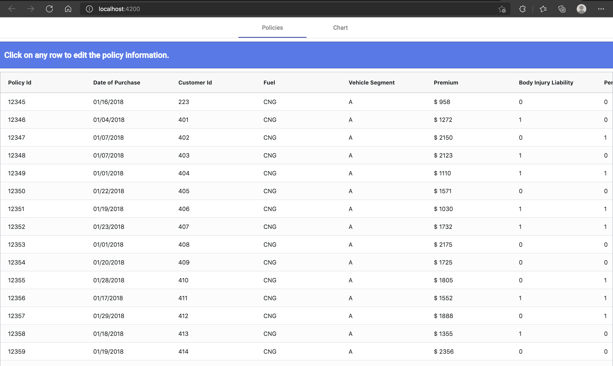
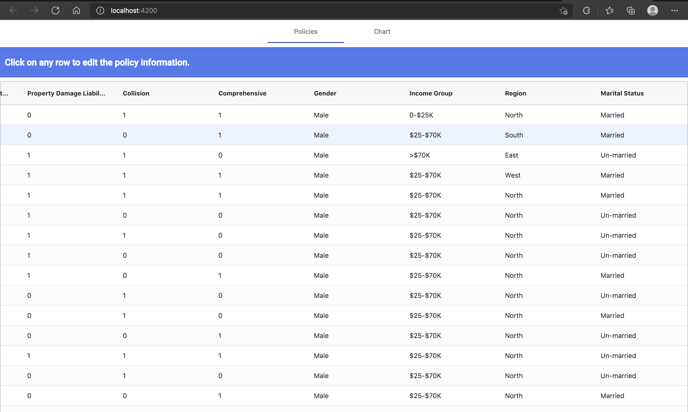
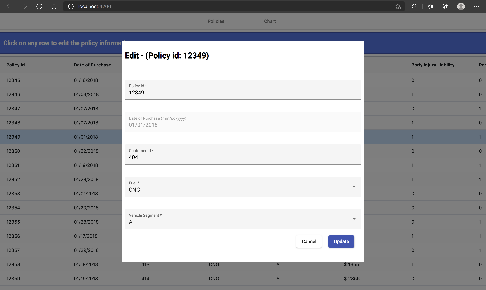
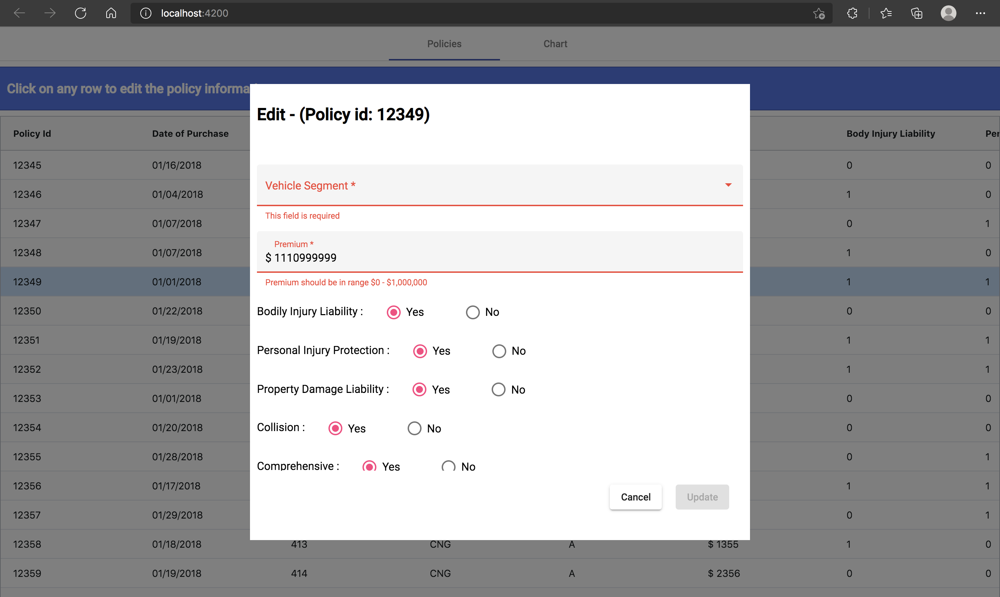
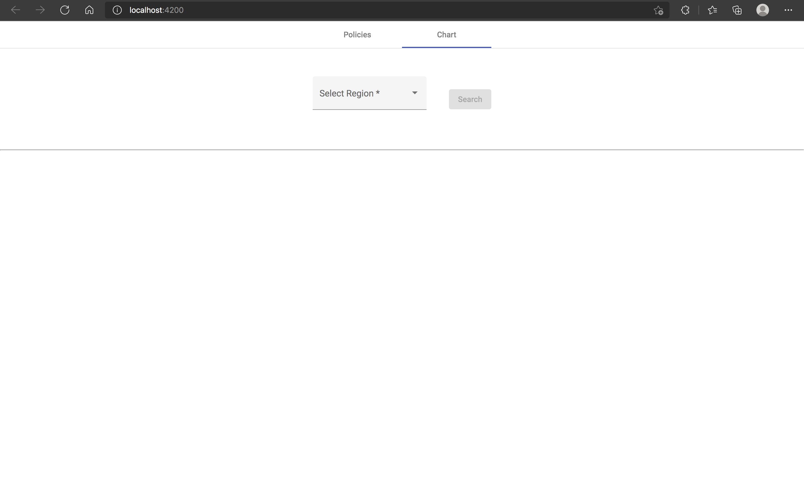
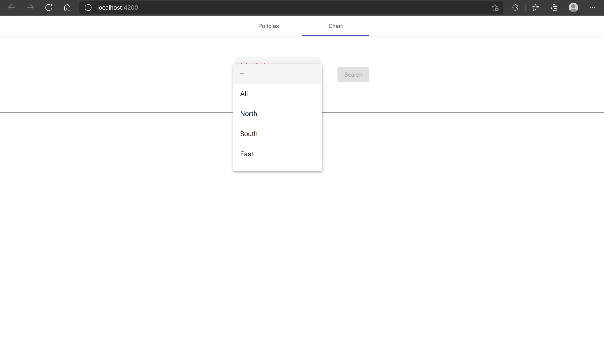
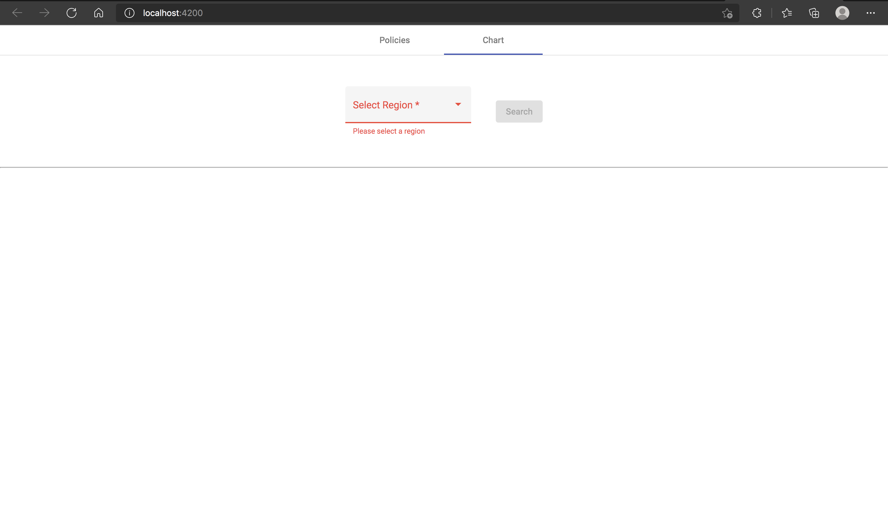
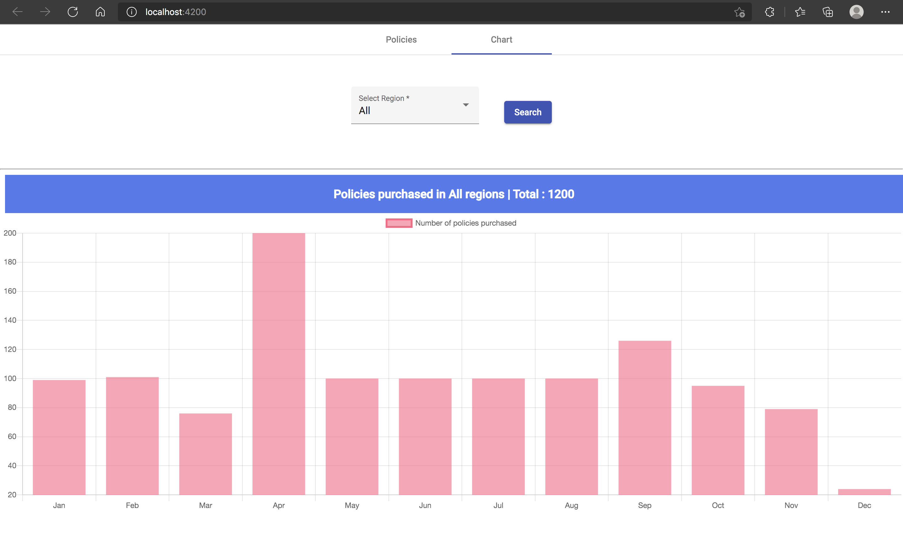
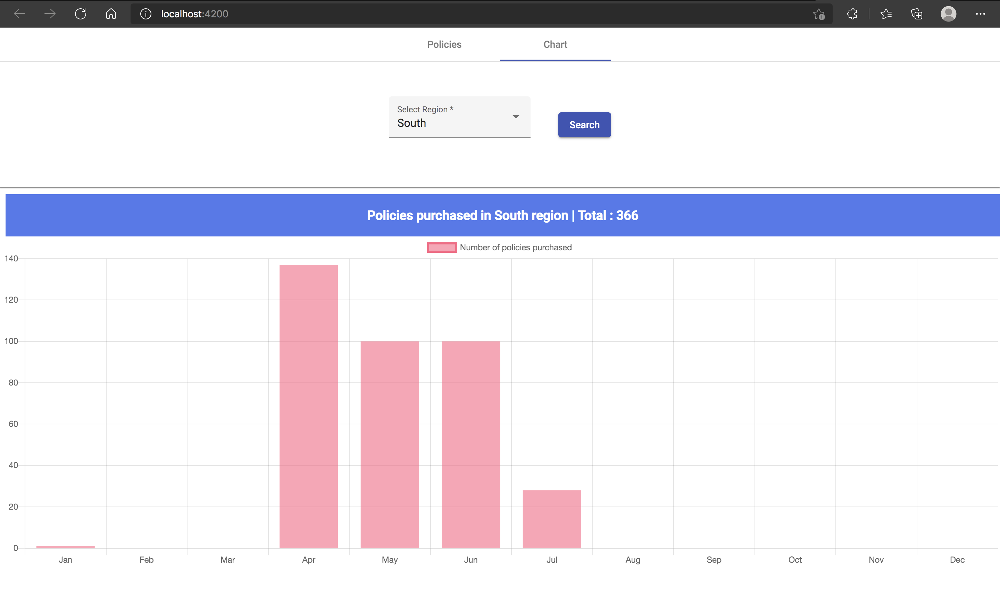

# node-ng-webapp

# Output Screenshots:
## 1. Landing Page

## 2. Scrollable Table

## 3. Row Edit Form

## 4. Form Validations

## 5. Valid Form

## 6. Charts Landing Page

## 7. Region Dropdown

## 8. Chart Form Validation

## 9. Bar chart for All regions' data.

## 10. Bar chart for One region data.
